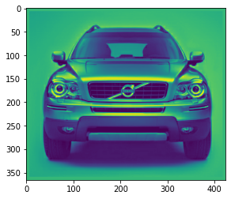
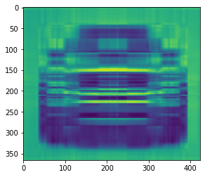
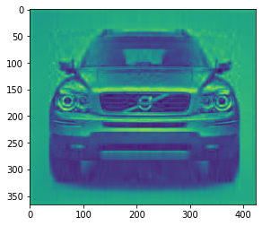
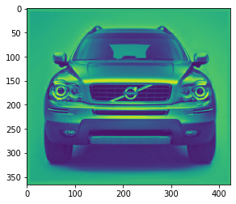
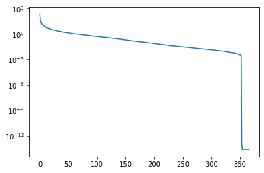
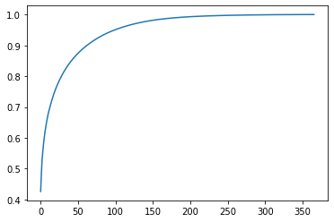

Matrix approximation with SVD


Overview
======

Very often in numerical modeling, the data we need to work with is rather large and therefore not really handy. Moreover, the behavior under investigation can be explained by small number of features. Thus, it is desireable to be able to approximate the matrices. One way to do so  is using the singular value decomposition method. 

Matrix approximation with SVD
======

In fact SVD provides an optimal low-rank approaximation to a matrix $A$ (this is the <a href="https://en.wikipedia.org/wiki/Low-rank_approximation">Eckart-Young theorem</a>). We can obtain a hierarchy of low rank matrices by just keeping the leading $k$ singular values and the corresponding eigenvectors.

Image copression is a simple example illustrating matrix approximation using SVD. We can view a grayscale image as matrix $A \in \mathbb{R}^{n\times m}$ where $n, m$ are the number of pixels in the vertical and horizonal directions.  

The Python code below computes the full SVD of the matrix representing the loaded image. We then compute approximations of the image using a range of retained singular values. We can see that as the number of retained singular values increases the quality of the image increases.


```python
import numpy as np
from matplotlib import image
import matplotlib.pyplot as plt
from numpy.linalg import matrix_rank
```


```python
def rgb2gray(rgb):
    return np.dot(rgb[...,:3], [0.2989, 0.5870, 0.1140])
```


```python
# load image as pixel array
A = image.imread('my_icons/volvo_img.png')
A = np.mean(A, -1)#rgb2gray(rgb=data)
# summarize shape of the pixel array
print(A.shape)
# display the array of pixels as an image
plt.imshow(A)
plt.show()
```

    (366, 424)





```python
print("Matrix rank ", matrix_rank(A))
```

    Matrix rank  307


```python
U, S, V = np.linalg.svd(A, full_matrices=False)
S = np.diag(S)
```


```python
print("Shape U ", U.shape)
print("Shape S ", S.shape)
print("Shape V ", V.shape)
```

    Shape U  (366, 366)
    Shape S  (366, 366)
    Shape V  (366, 424)


```python
for r in [5, 20, 100]:
    
    print("Working with r", r)
    # construct approximate image
    img_approx = U[:,:r] @ S[0:r,:r] @ V[:r,:] 
    plt.imshow(img_approx)
    plt.show()
```

    Working with r 5





    Working with r 20





    Working with r 100





```python
# plot the singular values
plt.semilogy(np.diag(S))
plt.show()

```





```python
# plot the cumulative sum of the singular values
plt.plot(np.cumsum(np.diag(S))/np.sum(np.diag(S)))
plt.show()
```





References
======
